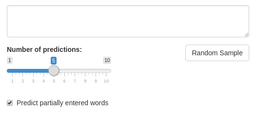
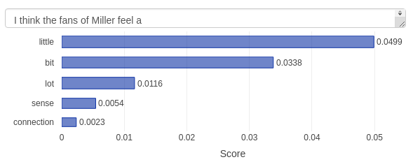

```{r setup, include=FALSE}
knitr::opts_chunk$set(echo = TRUE)
```

```{r echo=FALSE, message=FALSE, warning=FALSE}
library(dplyr)
library(hms)
library(kableExtra)
```

# Content

* [Synopsis](#synopsis)
* [Model](#model)
* [Implementation](#implementation)
* [Optimization](#optimization)
* [Extensions](#extensions)
* [Validation](#validation)
* [Application](#application)
* [References](#references)

# <a name="synopsis"></a>Synopsis

This document provides the background and describes the approach used to
implement the application "Next Word Prediction: Stupid Backoff".

The application was developed as a capstone project for the for the cycle of courses
[Data Science Specialization](https://www.coursera.org/specializations/jhu-data-science)
offered on [Coursera](https://www.coursera.org) by
[Johns Hopkins University](https://www.jhu.edu).
The purpose of the capstone project is to build a Natural Language Processing
(NLP) application that, given a chunk of text, predicts the next most probable
word. The application may be used, for example, in mobile devices to provide
suggestions as the user enters text, or as a part of a spelling correction
module in a text editor.

You may find the following links useful:

* Full version of this document: https://serdioa.github.io/DataScienceCapstone/ImplementationReport.html

* Presentation: https://serdioa.github.io/DataScienceCapstone/presentation/index.html

* Online application: https://serdioa.shinyapps.io/predict-sb

* Source code: https://github.com/serdioa/DataScienceCapstone

# <a name="model"></a>Model

Our application predicts the next word in a text given a prefix by using a
Markov Chain model simplified to n-grams.

The Markov Chain model assumes that in a natural language sentence
a probability of each word depends only on previous words. The n-gram model
simplifies the Markov Chain model by considering each word to depend only on
the previous N words, thus ignoring long-range dependency. The n-gram model
combines simplicity with an acceptable prediction quality, making it a model
of choice for many Natural Language Processing (NLP) applications.

# <a name="implementation"></a>Implementation

Coursera provides a training text corpora HC Corpora [(1)](#hc_corpora). The
corpora contains texts in several languages collected from various sources in
Web, including blogs, news web sites and Twitter. The English corpora consists
of approximately 4.2 millions lines of text.

We splitted the English corpus on 3 parts: training (60%), testing (20%) and
validation (20%). The training part was used to train the prediction algorithm,
the testing to optimize meta-parameters, and validation for the final validation
of the algorithm.

The training corpus was used to build 1- to 5-grams. Each n-gram was further
split on a (n-1)-gram prefix (empty for 1-grams) and a single-word suffix.
Our model attempts to predict the last word (suffix) based on previous 4 words
(prefix). For each n-gram $w_1,w_2,\ldots,w_{n}$ we store in a lookup table the
prefix $w_1,w_2,\ldots,w_{n-1}$, the suffix $w_n$, as well as
$P_{ML}(w_n | w_1,\ldots,w_{n-1})$, that is the maximum likehood estimate of the
conditional probability of the suffix $w_n$ given the prefix
$w_1,\ldots,w_{n-1}$.

The prediction algorithm consists of 2 steps: choosing candidates, and scoring
candidates to select the best matches.

We decided to use very simple choosing algorithm: we choose all available
candidates, proceeding from 5-grams to 1-grams and skipping suffixes which we
have already collected. Given the prefix $w_1,w_2,\ldots,w_{n-1}$, we choose
all 5-grams starting with the 4-gram prefix $w_{n-4},w_{n-3},w_{n-2},w_{n-1}$,
all 4-grams starting wihh the 3-gram prefix $w_{n-3},w_{n-2},w_{n-1}$, and so
on.

The scoring algorithm selects best N matches from all candidates by calculating
a numerical score of each candidate and choosing N candidates with top score.
The score may be a probability, but it may be a different type of a numerical
quantifier, as it is the case for the Stupid Backoff algorithm.

The Stupid Backoff algorithm is a high-efficient scoring
algorithm proposed in 2007 by Thorsten Brants et al [(2)](#stupid_backoff).
On large data sets the
algorithm gives scoring close to [Kneser-Ney algorithm](https://en.wikipedia.org/wiki/Kneser%E2%80%93Ney_smoothing),
but is significantly faster. The Stupid Backoff algorithm returns not
probabilities, but relative scores of words (they do not sum to 1), which is
sufficient for our purposes.

The Stupid Backoff algorithm is described by the following formula:

$SB(w_n|w_1, w_2,\ldots,w_{n-1}) =$

* $P_{ML}(w_n|w_1, w_2,\ldots,w_{n-1})$ if $P_{ML}(w_n|w_1, w_2,\ldots,w_{n-1}) > 0$

* $\lambda \; SB(w_n|w_2,\ldots,w_{n-1})$ otherwise.

where $P_{ML}(w_n|w_1, w_2,\ldots,w_{n-1})$ is the maximum likehood estimate of
the conditional probability of the suffix $w_n$ given the prefix
$w_1,\ldots,w_{n-1}$. Authors of the Stupid Backoff algorithm recommend to use
$\lambda = 0.4$.

In other words, first we attempt to look up the n-gram in the table for the
largest n available. If the n-gram is found, than the score of the last word
is the maximum likehood estimation of the conditional probability of the last
word given the prefix. Otherwise, we back off (hence the algorithm name) to a
table with (n-1)-grams, do the same calculations and multiply the result by
$\lambda = 0.4$. If the shorterned prefix is not found as well, the recursion
goes deeper, concluding on 1-grams.

# <a name="optimization"></a>Optimization

In our implementation of the Stupid Backoff algorithm we have applied several
optimizations to reduce the memory usage and latency.

* In prefixes of n-grams we use only $2^{16}-2$ words (stems) which
appear in the training text corpus most often. These words cover 99.4% of the
corpora. Words not included in the top list are replaced with a special token 
`UNK` ("Unknown") when appear in n-gram prefixes. This optimization applies only
to prefixes, the last word of each n-gram remains "as is".

* Using $2^{16}-2$ stems allows us to encode each stem, as well as 2 special
tokens, using 2 bytes. One of the special tokens is mentioned above `UNK` token,
another is the `STOS` ("Start-Of-Sentence") token.

```{r echo=FALSE, message=FALSE}
source("include/stat.R")

stat.ngram.extended.sw <- stat.ngram.extended.all.cache(removeStopwords = FALSE)
stat.ngram.opt.pref.sw <- stat.ngram.optimize.prefix.all.cache(removeStopwords = FALSE)
stat.ngram.opt.prob.sw <- stat.ngram.optimize.prob.all.cache(removeStopwords = FALSE)
stat.ngram.opt.final.sw <- stat.ngram.optimize.all.cache() %>% filter(Threshold == 6)

stat.ngram.size.orig <- sum(stat.ngram.extended.sw$Size)
stat.ngram.size.pref <- sum(stat.ngram.opt.pref.sw$Size)
stat.ngram.size.prob <- sum(stat.ngram.opt.prob.sw$Size)
stat.ngram.size.final <- sum(stat.ngram.opt.final.sw$Size)
```

* R is not especially rich on low-level data types. It provides a type `raw`
which claims to work with bytes, but this type is very storage-inefficient. We
have to use available primitive data types `integer` and `numeric` to encode
n-gram prefixes. R stores the data type `integer` using 4 bytes, and we have
used it to encode 1- and 2-stem prefixes. The data type `numeric` has 8 bytes,
and we have encoded 3- and 4-stem prefixes in it. Using binary encoding allows
to noticeably reduce memory for storing n-grams. All n-gram tables without
binary encoding of prefixes require
`r formatC(stat.ngram.size.orig, big.mark = ",", format = "f", digits = 1)` MiB,
whereas after encoding prefixes they require only
`r formatC(stat.ngram.size.pref, big.mark = ",", format = "f", digits = 1)` MiB,
reducing the memory usage by
`r sprintf("%.2f%%", 100 * (1 - stat.ngram.size.pref / stat.ngram.size.orig))`.

* Conditional probabilities in n-gram tables are naturally represented
by R `numeric` type which requires 8 bytes. We may reduce the storage by half
without loosing much precision by applying a scaled-Log transformation: 
instead of storing a probability $P$, we store the value $int(log(P) * 10^6)$.
The R type `integer` require only 4 bytes, and we are storing logarithm with
6 digits after the decimal point (transformed to an integer). It is easy to
check that the precision lost caused by such transformation is negligible.
Applying this optimization reduces the total memory usage to
`r formatC(stat.ngram.size.prob, big.mark = ",", format = "f", digits = 1)` MiB,
that is by further
`r sprintf("%.2f%%", 100 * (1 - stat.ngram.size.prob / stat.ngram.size.pref))`.

* We may further reduce memory requirements by removing seldom n-grams, that is
n-grams which appear $m$ times or less. Our tests demonstrated that we get the
best prediction rate when excluding n-grams which appear only once and keeping
all the rest. On the other hand, if we keep only n-grams which appear at least
6 times, the prediction quality falls by approximately 1.5%, but the
memory usage is dramatically reduced. After removing seldom n-grams our memory
requirements fall down to
`r formatC(stat.ngram.size.final, big.mark = ",", format = "f", digits = 1)`
MiB, that is just to
`r sprintf("%.2f%%", stat.ngram.size.final / stat.ngram.size.orig * 100)`
of the original size.

By using all optimization techniques mentioned above, we were able to reduce the
memory required to keep n-gram tables to
`r formatC(stat.ngram.size.final, big.mark = ",", format = "f", digits = 1)` MiB
(12 MiB in compressed RDS format). The average time required to predict
10 top-scoring candidates was under 20 ms on our hardware.

# <a name="extensions"></a>Extensions

We added to the base algoritm a simple optional extension which allows to
predict a word the user is currently typing. As long as the last typed character
is not the space character, the algorithm assumes that the user continues to
type the current word, and predicts it. Only after a space character is typed
the algorithm predicts the next word.

The extension pretty easy integrates in the step when we choose candidate words.
Given the prefix $w_1,w_2,\ldots,w_{n-1}$ and a partially typed word
$w^\prime_n$ we choose all 5-gram candidates which starts with the prefix
$w_1,w_2,\ldots,w_{n-1}$ and the 5th word starts with the word prefix
$w^\prime_n$, and similarly for 4- to 1-grams.

Some words may be missing in our dictionary, and the user may misspell some
words. If we can't find any candidates using our n-grams, we attempt to predict
the next word using the partialy entered word by applying a spelling correction
algorithm provided by the R package `hunspell`. For example, if the user enters
a misspelled word "mashine", we propose the spell-corrected word "machine".

# <a name="validation"></a>Validation

As you may remember from the [Implementation](#implementation), we have
preserved 20% of the data for an off-sample validation test. The test was done
as follows:

* Choose 100.000 random sample sentences from each source (blogs, news,
Twitter). Split each selection on 100 batches, each of 1000 sentences.

* Create an aggregated test set of 100.000 sentences by choosing 1/3 of
sentences from each source. Split the aggregated test set on batches as well.

* Choose a random word in a sentence, but not the very first word. Use the part
of the sentence before the selected word as a prefix, and attempt to predict
the selected word.

* Run the prediction algorithm for all samples, predicting top 5 candidates.

* For each batch of 1000 sentences, calculate percentage of cases when the
word actually present in the sentence was in top 1, top 3 or top 5 of predicted
candidates.

```{r echo=FALSE, message=FALSE}
stat.validation <- stat.predict.sources.agg.n.build(6, "validation")
stat.validation.blogs.1 <- stat.validation %>%
  filter(Source == "blogs" & Rank == 1) %>%
  pull(Mean)
stat.validation.blogs.3 <- stat.validation %>%
  filter(Source == "blogs" & Rank == 3) %>%
  pull(Mean)
stat.validation.blogs.5 <- stat.validation %>%
  filter(Source == "blogs" & Rank == 5) %>%
  pull(Mean)
```

The chart below shows results of the algorithm validation. For example, for
blogs our algorithm correctly predicted the next word in 
`r sprintf("%.2f%%", stat.validation.blogs.1 * 100)` of cases,
the correct result was in top 3 predictions in
`r sprintf("%.2f%%", stat.validation.blogs.3 * 100)` of cases,
and in top 5 in
`r sprintf("%.2f%%", stat.validation.blogs.5 * 100)` of the cases.

```{r echo=FALSE, message=FALSE, fig.align = "center", fig.width = 10}
stat.predict.validation.chart()
```

The following table shows the mean quality of our prediction algorithm (in which
percentage of cases the right word was in top 1, top 3 and top 5), as well
as 95% confidential interval.

```{r echo=FALSE, message=FALSE}
stat.predict.validation.tbl.sw <- function() {
  stat.sw <- stat.predict.sources.agg.n.build(6, "validation", removeStopwords = FALSE) %>%
    arrange(Source) %>%
    mutate(Mean = Mean * 100,
           ConfIntLow = ConfIntLow * 100,
           ConfIntHigh = ConfIntHigh * 100)
  
  stat.sw.1 <- stat.sw %>% filter(Rank == 1)
  stat.sw.3 <- stat.sw %>% filter(Rank == 3)
  stat.sw.5 <- stat.sw %>% filter(Rank == 5)

  stat.sw.1.tbl <- data.frame(
    Source = c("Aggregated", "Blogs", "News", "Twitter"),
    Mean.1 = sprintf("%.2f", stat.sw.1$Mean),
    ConfInt.1 = sprintf("(%.2f, %.2f)", stat.sw.1$ConfIntLow, stat.sw.1$ConfIntHigh),
    Mean.3 = sprintf("%.2f", stat.sw.3$Mean),
    ConfInt.3 = sprintf("(%.2f, %.2f)", stat.sw.3$ConfIntLow, stat.sw.3$ConfIntHigh),
    Mean.5 = sprintf("%.2f", stat.sw.5$Mean),
    ConfInt.5 = sprintf("(%.2f, %.2f)", stat.sw.5$ConfIntLow, stat.sw.5$ConfIntHigh),
    stringsAsFactors = FALSE
  )
  
  kable(stat.sw.1.tbl,
        caption = "Prediction precision (validation)",
        booktabs = TRUE,
        col.names = c("Source", rep(c("Mean, %", "Conf. Int. 95%"), 3))) %>%
    add_header_above(header = c("",
                                "Word correctly predicted" = 2,
                                "Word in Top 3" = 2,
                                "Word in Top 5" = 2)) %>%
    kable_styling(bootstrap_options = c("striped", "bordered", "hover"),
                  full_width = FALSE)
}

stat.predict.validation.tbl.sw()
```

As the table demonstrates, our predictions are more precise for news,
less precise for blogs and Twitter. This is to be expected: news use more formal
language where common expressions tend to repeat, whereas in blogs and
especially on Twitter authors often prefer brevity to correctness.

# <a name="application"></a>Application

A [Shiny application](https://shiny.rstudio.com) using our prediction algorithm
is available online: https://serdioa.shinyapps.io/sb-predict.

The application GUI provides the following elements:

* Text area: enter the text here, and predicted words will appear on the chart
below. The chart shows multiple candidates ordered by score, providing a visual
clue on how probable each candidate is. When "Predict partially entered words"
is activated, **you have to type the space character to predict the next word**,
otherwise an ending of the current word is predicted.

* Number of predictions: choose from 1 to 10 candidates to predict.

* Predict partially entered words: select the checkbox to activate the extension
which predicts partially entered words.

* Random sample: populate the text area with a random sample from a selection
of over 1000 prepared sample texts.



* The application shows predictions as you type, displaying a chart with ranks
of predicted words.



* The prediction itself takes less than 20 ms, most of the observed delay is due
to the Shiny framework and network latency.

# <a name="references"></a>References

<a name="hc_corpora"></a>(1) HC Corpora provided by [corpora.epizy.com](http://corpora.epizy.com).
[About the corpora](http://corpora.epizy.com/about.html). [Download the corpora](https://d396qusza40orc.cloudfront.net/dsscapstone/dataset/Coursera-SwiftKey.zip).

<a name="stupid_backoff"></a>(2) Thorsten Brants, Ashok C. Popat, Peng Xu,
Franz J. Och, Jeffrey Dean. 2007. Large Language Models in Machine
Translation. [https://www.aclweb.org/anthology/D07-1090](https://www.aclweb.org/anthology/D07-1090).
