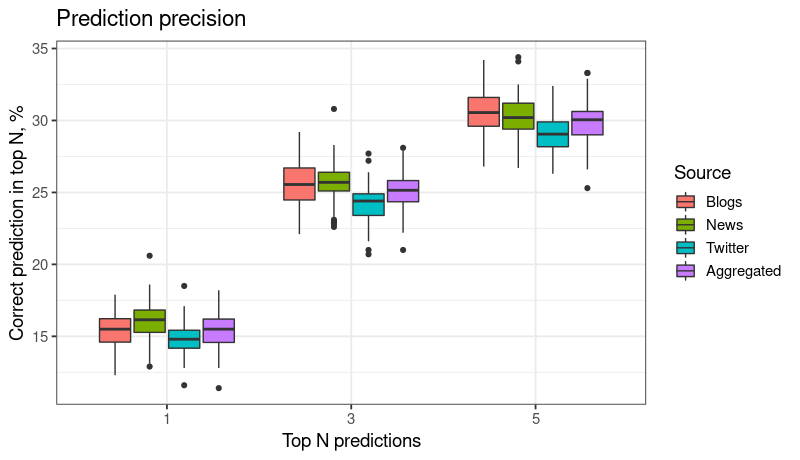

# Content

* [Synopsis](#synopsis)
* [Model](#model)
* [Implementation](#implementation)
* [Optimization](#optimization)
* [Extensions](#extensions)
* [Testing](#testing)
* [Application](#application)
* [References](#references)

# Synopsis

This document provides a background and describes the application "Next Word
Prediction: Stupid Backoff".

The application was developed as a capstone project for the for the cycle of courses
[Data Science Specialization](https://www.coursera.org/specializations/jhu-data-science)
offered on [Coursera](https://www.coursera.org) by
[Johns Hopkins University](https://www.jhu.edu).

The purpose of the capstone project is to build a Natural Language Processing
(NLP) application that, given a chunk of text, predicts the next most probable
word. The application may be used, for example, in mobile devices to provide
suggestions as the user tips in some text, or as a part of a spelling correction
module in a text editor.

This document provides a short overview of the application. For a longer
description, source code and more visit the GitHub site:
https://github.com/serdioa/DataScienceCapstone.

# Model

This application predicts the next word in a text using Markov Chain model
simplified to n-grams.

The Markov Chain model assumes that in a natural language sentence
a probability of each word depends only on previous words. The n-gram model
simplifies the Markov Chain model by considering each word to depend only on
the previous N words, thus ignoring long-range dependency. The n-gram model
combines simplicity with an acceptable prediction quality, making it a model
of choice for many applications.

# Implementation

Coursera provides a training text corpora HC Corpora [(1)](#hc_corpora).
The corpora contains texts in several languages
collected from various sources in Web, including blogs, news web sites and
Twitter.

We splitted the English corpus on 3 parts: training (60%), testing (20%) and
validation (20%). The training part was used to train the prediction algorithm,
the testing to optimize meta-parameters, and validation for the final validation
of the algorithm.

The training corpus was used to build 1- to 5-grams. Each n-gram was further
split on a (n-1)-gram prefix (empty for 1-grams) and a single-word suffix.
Our model attempts to predict the last word (suffix) based on previous 4 words
(prefix). For each n-gram *w1, w2, ..., wn* we store in a lookup table the
prefix *w1, w2, ..., wn-1*, the suffix *wn*, as well as the empirical conditional
probability of suffix given prefix *PE(wn | w1, w2, ..., wn-1)*.

The prediction algorithm consists of 2 steps: choosing candidates, and ranking
candidates to select the best matches.

Performance tests demonstrated that we may use a very simple choosing algorithm:
given the prefix *w1, w2, ..., wn-1*, we choose all 5-grams starting
with the 4-gram prefix *wn-4, wn-3, wn-2, wn-1*, all 4-grams starting
with the 3-gram prefix *wn-3, wn-2, wn-1* and so on.

The ranking algorithm selects best N matches from all candidates by calculating
a numerical rank of each candidate and choosing N candidates with top rank.
The rank may be a probability, but it may be a different type of a numerical
quantifier, as it is the case for the Stupid Backoff algorithm.

The Stupid Backoff algorithm is a high-efficient ranking
algorithm proposed in 2007 by Thorsten Brants et al [(2)](#stupid_backoff).
On large data sets the
algorithm gives ranking close to [Kneser-Ney algorithm](https://en.wikipedia.org/wiki/Kneser%E2%80%93Ney_smoothing),
but is significantly faster. The Stupid Backoff algorithm returns not
probabilities, but relative ranks of words (they do not sum to 1), which is
sufficient for our purposes.

The Stupid Backoff algorithm is described by the following formula:

*SB(wn | w1, w2, ..., wn-1) =*

* *PE(wn | w1, w2, ..., wn-1)*
if *PE(wn | w1, w2, ..., wn-1)* > 0,

* *&lambda; SB(wn | w2, ..., wn-1)* otherwise,

where *PE(wn | w1, w2, ..., wn-1)* is the empirical conditional probability
of the word *wn* given preceding words *w1, w2, ..., wn-1*. Authors of the
Stupid Backoff algorithm recommend to use *&lambda;* = 0.4.

In other words, first we attempt to look up the n-gram in the table for the
largest n available. If the n-gram is found, than the rank of the last word
is the empirical conditional probability of the last word given the prefix. Otherwise,
we back off (hence the algorithm name) to a table with (n-1)-grams, do the same
calculations and multiply the result by &lambda; = 0.4. If the shorterned prefix
is not found as well, the recursion goes deeper, concluding on 1-grams.

# Optimization

In our implementation of the Stupid Backoff algorithm we have applied several
optimizations to reduce the memory usage and latency.

* In prefixes of n-grams we use only 216 - 2 words (stems) which appear in the
training text corpus most often. These words cover 99.4% of the corpora.
Words not included in the top list are replaced with a special token UNK
("Unknown") when appear in n-gram prefixes. This optimization applies only to
prefixes, the last word of each n-gram remains "as is".

* Using 2^16 - 2 stems allows us to encode each stem, as well as 2 special tokens,
using 2 bytes. One of the special tokens is mentioned above UNK token, another
is the STOS ("Start-Of-Sentence") token.

* R is not especially rich on low-level data types. It provides a "raw" type
which claims to work with bytes, but this type is very storage-inefficient.
We have to use available primitive data types "integer" and "numeric" to encode n-gram
prefixes. R stores the "integer" data type using 4 bytes, and we have used
it to encode 1- and 2-stem prefixes. The "numeric" data type has 8 bytes, and
we have encoded 3- and 4-stem prefixes in it. Using binary encoding allows to
noticeably reduce memory for storing n-grams. For example, for 5-grams (prefix
length 4), we require 3.5 GB when using plain-text n-grams, but only 834 MB
when using binary encoding, reducing memory usage by 76.5%.

* We may further reduce memory requirements by removing seldom n-grams, that is
n-grams which appear K times or less. Our tests demonstrated that we get the
best prediction rate when excluding n-grams which appear only 1 time and keeping
all the rest. On the other hand, if we exclude n-grams which appear only
5 times or less, the prediction quality falls by approximately 1%, but the
memory usage is significantly reduced once more. For example, for 5-grams
(prefix length 4) we require 834 MB to store all n-grams using binary encoding,
but only 3.7 MB if excluding all 5-grams which appear 5 times or less, reducing
memory usage by further 99.5%.

* Empyrical conditional probabilities in n-gram tables are naturally represented
by R "numeric" type which requires 8 bytes. We may reduce the storage by half
without loosing much precision by applying a scaled-Log transformation: 
instead of storing probability *P*, we store the value *int(log(P) * 1000000)*.
The R type "integer" require only 4 bytes, and we are storing logarithm with
6 digits after the decimal point (transformed to an integer).

By using all optimization techniques mentioned above, we were able to reduce the
memory required to keep n-gram tables to 53.5 MB (12 MB in compressed RDS
format). The average time required to predict 10 top-ranking candidates was
under 20 ms on our hardware.

# Extensions

The application adds an extension to the simple prediction of the next word:
it allows to predict a word the user is currently typing. As long as the last
typed character is not the space character, the application assumes that the
user continues to type the current word, and predicts it. Only after a space
character is typed the application predicts the next word.

The extension pretty easy integrates in the step when we choose candidate words.
Given the prefix *w1, w2, ..., wn-1*
and a partially typed word *w'n*,
we choose all 5-gram candidates which starts with the prefix
*wn-4, wn-3, wn-2, wn-1*
and the 5th word starts with the word prefix
*w'n*, and similarly for 4- to 1-grams.

Some words may be missing in our dictionary, and the user may misspell some
words. If we can't find any candidates using our n-grams, we attempt to predict
the next word using the partialy entered word by applying a spelling correction
algorithm provided by the R package "hunspell". For example, if the user enters
a misspelled word "mashine", we propose the spell-corrected word "machine".

# Testing

As you may remember from the [Implementation](#implementation), we have
preserved 20% of the data for an off-sample validation test. The test was done
as follows:

* Choose 100.000 random sample sentences from each source (blogs, news, Twitter).
Split each selection on 100 samples, each of 1000 sentences.

* Create an aggregated test set of 100.000 sentences by choosing 1/3 of
sentences from each source.

* Choose a random word in a sentence, but not the very first word. Use the part
of the sentence before the selected word as a prefix, and attempt to predict
the selected word.

* Run the prediction algorithm for all samples, predicting top 5 candidates.

* For each batch of 1000 sentences, calculate percentage of cases when the
word actually present in the sentence was in top 1, top 3 or top 5 of predicted
candidates.

The chart below shows results of the test run. For example, for blogs our
algorithm correctly predicted the next word in 15.43% of cases, the correct
result was in top 3 predictions in 25.51% of the cases, and in top 5 in 30.55%
of the cases.

The following table shows the mean quality of our prediction algorithm (in which
percentage of cases the right word was in top 1, top 3 and top 5), as well
as 95% confidential interval.

<table class="table table-condensed">
    <thead>
        <tr class="header">
            <th rowspan="2">Source</th>
            <th colspan="2" align="center">Word correctly predicted</th>
            <th colspan="2" align="center">Word in Top 3</th>
            <th colspan="2" align="center">Word in Top 5</th>
        </tr>
        <tr class="header">
            <th align="right">Mean, %</th>
            <th align="right">Conf. Int. 95%</th>
            <th align="right">Mean, %</th>
            <th align="right">Conf. Int. 95%</th>
            <th align="right">Mean, %</th>
            <th align="right">Conf. Int. 95%</th>
        </tr>
    </thead>
    <tbody>
        <tr class="odd">
            <td>Blogs</td>
            <td align="right">15.43</td>
            <td align="right">(15.19, 15.66)</td>
            <td align="right">25.51</td>
            <td align="right">(25.21, 25.82)</td>
            <td align="right">30.55</td>
            <td align="right">(30.24, 30.85)</td>
        </tr>
        <tr class="even">
            <td>News</td>
            <td align="right">16.12</td>
            <td align="right">(15.87, 16.36)</td>
            <td align="right">25.71</td>
            <td align="right">(25.44, 25.97)</td>
            <td align="right">30.24</td>
            <td align="right">(29.96, 30.51)</td>
        </tr>
        <tr class="odd">
            <td>Twitter</td>
            <td align="right">14.78</td>
            <td align="right">(14.56, 15.00)</td>
            <td align="right">24.20</td>
            <td align="right">(23.97, 24.44)</td>
            <td align="right">29.09</td>
            <td align="right">(28.84, 29.35)</td>
        </tr>
        <tr class="even">
            <td>Aggregated</td>
            <td align="right">15.39</td>
            <td align="right">(15.14, 15.65)</td>
            <td align="right">25.04</td>
            <td align="right">(24.78, 25.30)</td>
            <td align="right">29.87</td>
            <td align="right">(29.59, 30.15)</td>
        </tr>
    </tbody>
</table>

As the table demonstrates, our predictions are less precise for Twitter,
more precise for blogs and news. This is to be expected: Twitter is the least
formal of the sources, where people often prefer brevity to correctness.

# Application

The application GUI provides the following elements:

* Text area: start entering the text there, and predicted words will appear
on the chart below. The chart shows all words ordered by rank, providing a
visual clue on how probable each candidate is. When "Predict partially entered
words" is activated, **you have to type the space character to predict the next
word**, otherwise an ending of the current word is predicted.

* Number of predictions: choose from 1 to 10 candidates to predict.

* Predict partially entered words: select the checkbox to activate the extension
which predicts partially entered words.

* Random sample: populate the text area with a random sample from a selection
of over 1000 prepared sample texts.

# References

* (1) HC Corpora provided by [heliohost.org](heliohost.org).
[About the corpora](https://web.archive.org/web/20160930083655/http://www.corpora.heliohost.org/aboutcorpus.html). [Download the corpora](https://d396qusza40orc.cloudfront.net/dsscapstone/dataset/Coursera-SwiftKey.zip).

* (2) Thorsten Brants, Ashok C. Popat, Peng Xu,
Franz J. Och, Jeffrey Dean. 2007. Large Language Models in Machine
Translation. [https://www.aclweb.org/anthology/D07-1090](https://www.aclweb.org/anthology/D07-1090).

